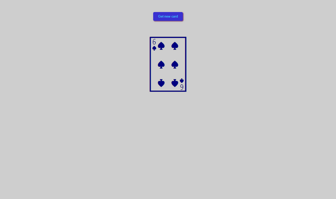

# Learn and practice in [React](https://reactjs.org/)

## **Projects:**

* ### [favorite-animal](favorite-animal)

* ### [product-table](product-table)

* ### [zesty-gallery](zesty-gallery)

* ### [puzzle-effect](puzzle-effect)

* ### [books-lib](books-lib)

* ### [tic-tac-toe](tic-tac-toe)

* ### [search-filter](search-filter)

* ### [search-filter-backend](search-filter-backend)

* ### [random-card](random-card)

## Getting Started

Clone the repo:

`git clone https://github.com/lap-4ront/react.git`

Go to folder you are interested in:

cd react/[selected project](#projects)  (favorite-animal | product-table | zesty-gallery | etc...)

Install dependencies:

## `npm install`

Launch the app:

## `npm start`

Open [http://localhost:3000](http://localhost:3000) to view it in your browser.

[Back &#8679;](#projects)
